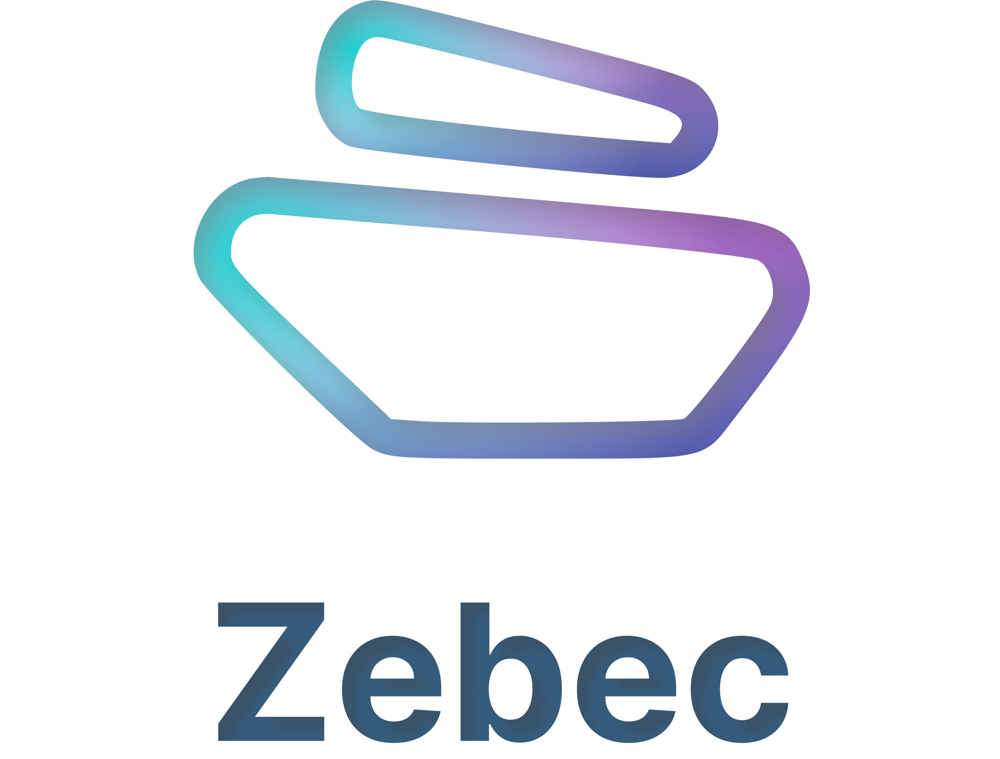

# Zebec SDK Dotnet

Zebec SDK Dotnet is a sdk written in c#.NET that implements the [Zebec Protocol](https://zebec.io/).

## What is Zebec Protocol?

The [Zebec Protocol](https://zebec.io/) is a Solana based modern day Payroll solution which allows employers to pay employees every second through its continuous settlement mechanism.

> Zebec is a revolutionary DeFi technology that empowers real-time, frictionless and continuous streams of payments.

## Zebec Program

Devnet - 
```
AknC341xog56SrnoK6j3mUvaD1Y7tYayx1sxUGpeYWdX
```
Mainnet -
```
AknC341xog56SrnoK6j3mUvaD1Y7tYayx1sxUGpeYWdX
```

## Requirements

- .Net 6.0

## Dependencies

- Solnet.Programs
- Solnet.Rpc
- Solnet.Wallet
